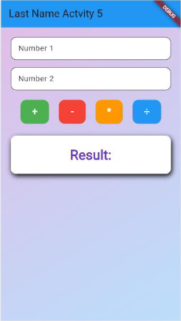

<div align="center">

# 📱 Murillo Activity 5 - Flutter Calculator

A clean, modern, and beautifully styled Flutter Calculator application built as part of Activity 5 coursework. Features smooth gradient aesthetics, custom rounded operator controls, safe arithmetic error handling, and elevated result presentation.

[](https://flutter.dev)
[](https://dart.dev)
[](https://flutter.dev)
[](LICENSE)

<br/>



</div>

---

## ✨ Features

- **🎨 Modern Pastel Gradient UI**: Built with an elegant `LinearGradient` blending soft purple and blue hues (`Colors.purple.shade100` to `Colors.blue.shade100`).
- **🔢 Two Number Inputs**: Clean rounded `TextField` inputs with numeric keyboard configuration.
- **⚡ Custom Operator Actions**:
  - `+` Addition (Vibrant Green)
  - `-` Subtraction (Bold Red)
  - `*` Multiplication (Warm Orange)
  - `÷` Division (Crisp Blue)
- **🛡️ Robust Error Handling**: Division by zero is safely caught and gracefully informs the user with `"Cannot divide by zero"`.
- **✨ 3D Elevated Result Card**: The calculation result is showcased inside an elevated, rounded container with realistic drop shadow effects and bold deep-purple typography.
- **🧱 Modular Architecture**: Complete separation of UI & logic in [`lib/calculator.dart`](lib/calculator.dart) from the app entrypoint in [`lib/main.dart`](lib/main.dart).
- **🧪 Comprehensive Test Suite**: 100% automated test coverage verifying all mathematical operations, UI component rendering, and edge cases.

---

## 📂 Project Structure

```text
calculator/
├── lib/
│   ├── calculator.dart     # Standalone Calculator StatefulWidget & business logic
│   └── main.dart           # App entrypoint and MaterialApp root
├── test/
│   ├── calculator_test.dart# Unit & widget tests for calculator operations and UI
│   └── widget_test.dart    # Smoke test for app initialization
├── screenshots/
│   └── calculator_preview.png # Application UI screenshot
├── pubspec.yaml            # Project dependencies and configuration
└── README.md               # Project documentation
```

---

## 🚀 Getting Started

### Prerequisites

- [Flutter SDK](https://docs.flutter.dev/get-started/install) (version `^3.13.0` or higher)
- [Dart SDK](https://dart.dev/get-dart)
- An emulator, physical device, or desktop environment

### Installation

1. **Clone the repository:**
   ```bash
   git clone https://github.com/90377Sednaaa/Flutter-Activity-5.git
   cd Flutter-Activity-5
   ```

2. **Install dependencies:**
   ```bash
   flutter pub get
   ```

3. **Run the app:**
   ```bash
   flutter run
   ```

---

## 🧪 Running Tests

Execute the automated test suite to verify UI rendering and arithmetic calculations:

```bash
flutter test
```

All 7 test cases (addition, subtraction, multiplication, division, zero-division handling, and smoke tests) will execute and pass.

---

## 👤 Author

**Murillo**
* GitHub: [@90377Sednaaa](https://github.com/90377Sednaaa)

